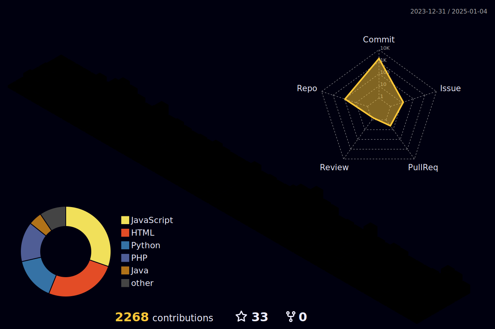

# 👋 Hello! Welcome to My GitHub Profile

  
  

---

## 🚀 수상 경력
- **금메달**: 인천지방기능경기대회 웹 디자인 및 개발 직종
- **장려상**: 전국기능경기대회 웹 디자인 및 개발 직종

---

## 🏢 경력 사항
- **2023년 8월 ~ 현재**: 두나정보기술 소프트웨어 개발자

---

## 🛠️ Skills

### 🌐 Web Development

  
  
  
    
  
  
  
  

### 📊 기타 스킬

   
  
  

---

## 📬 Contact Me
- 📧 **Email**: 24457545yong@gmail.com
- 📸 **Instagram**: [xo._.dnd](https://instagram.com/xo._.dnd)

---

## 🌱 About Me
**"1일 1커밋을 목표로 성실히 성장하는 개발자입니다."**  
프로젝트 관리, 웹 개발, AI 등 다양한 분야에 도전하고 있으며, 끊임없이 배우며 성장하고 있습니다.
